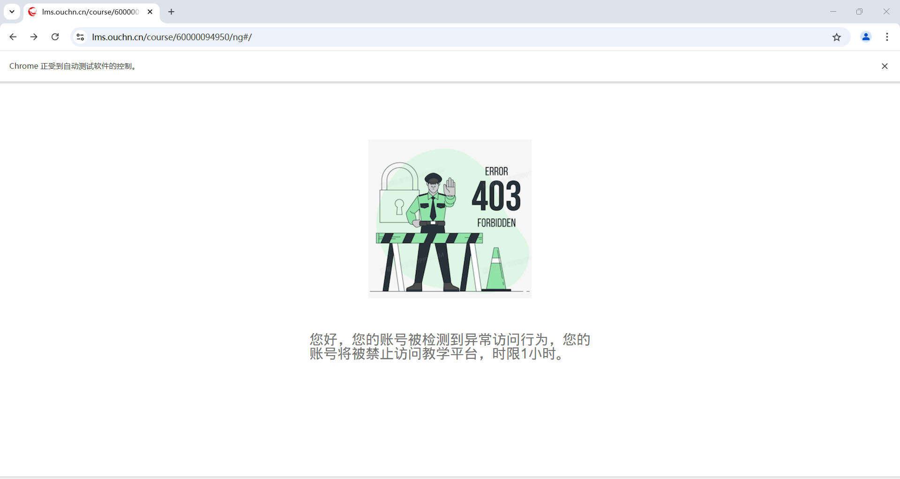

### 使用nodejs, playwright构建的国开自动刷课

---

#### 准备
- 下载 , 
- 打开`cmd` 运行 `npm install` 命令下载依赖

#### 配置
- 添加.env文件, 写入
```properties
_LOGIN_URL="https://iam.pt.ouchn.cn"
_HOME_URL="https://lms.ouchn.cn"

_ACCOUNT="xxx" # 账号
_PASSWORD="xxx" # 密码
_CHROME_DEV="C:\Program Files\Google\Chrome Dev\Application\chrome.exe" # chrome dev路径
_USER_DATA="C:\ChromiumCache" # 缓存
```

#### 运行
```shell
npm run start
```

#### 注意
- 操作浏览器:
  - 当登录时进行人机验证需要手动操作
  - 登录完成之后最好不要碰浏览器,不然可能会出现意外的错误
- 更换浏览器内核:
  - 当使用firefox时
    - 浏览器置于后台会暂停加载: 解决办法无
    - 缓存无法正常工作,每次需要重新登录: 解决办法无
  - 当使用webkit时:
    - 无
  - 使用chromium
    - 目前未发现未解决问题
